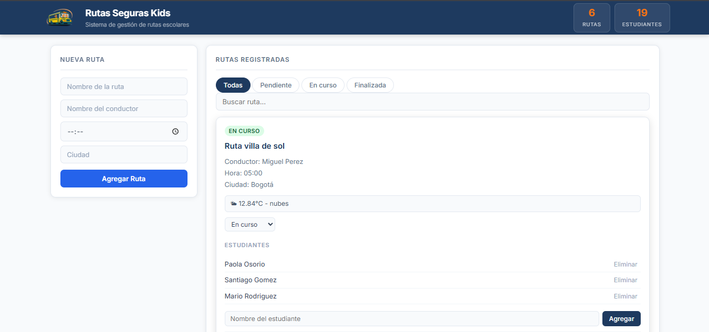
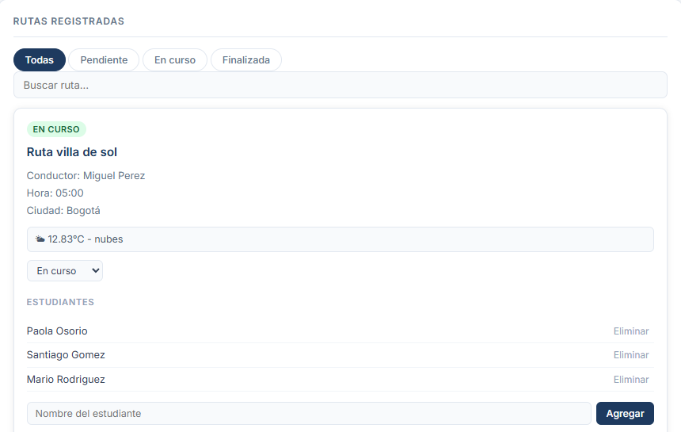
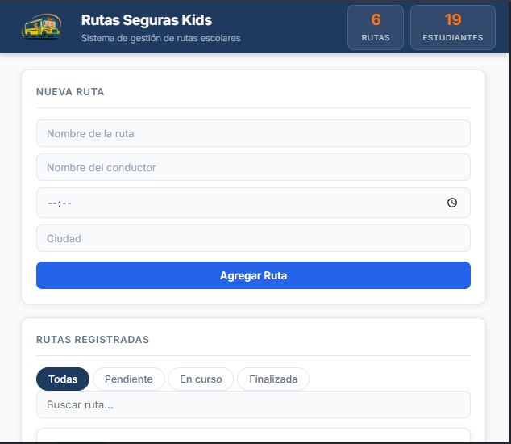

# Rutas Seguras Kids
Sistema Frontend para la gestion de rutas escolares y asignacion de estuadiantes a las rutas, desarrollador con HTML5, CSS3 y JavaScript.

## Descripción
Rutas Seguras Kids es una aplicación web que permite a la empresa del mismo nombre organizar sus rutas escolares de forma dinámica. Desde la interfaz es posible crear rutas, asignar estudiantes, cambiar el estado de cada ruta y consultar el clima en tiempo real de la ciudad donde opera cada ruta.

El proyecto fue desarrollado sin frameworks ni librerías externas, con el objetivo de demostrar dominio de manipulación del DOM, eventos personalizados, asincronía, Web Components y diseño responsivo

## Funcionalidades
- Crear, editar y eliminar rutas escolares (nombre, conductor, hora de salida, ciudad)
- Asignar y eliminar estudiantes en cada ruta
- Cambiar el estado de una ruta: Pendiente, En curso o Finalizada
- Filtrar rutas por estado y buscar por nombre o ciudad
- Consulta del clima en tiempo real usando la API de **OpenWeatherMap**
- Persistencia de datos con localStorage
- Contador de rutas y estudiantes en el encabezado
- Notificaciones visuales ante cada acción

## Tecnologías Utilizadas
- HTML5
- CSS3 (Variables CSS, Flexbox, Grid, Media Queries)
- JavaScript
- Web Components con Shadow DOM
- API: OpenWeatherMap

# Instruciones de Ejecución
1. Clona el repositorio:
   git clone https://github.com/yenico623/rutas-seguras-kids.git

2. Entra en la carpeta del proyecto
   cd rutas-seguras-kids

3. Abre el archivo **index.html** en tu navegador. No requiere servidor ni instalación de dependencias
   
   *Si el navegador bloquea las peticiones fetch por política CORS al abrir el archivo     directamente, usa la extensión Live Server de VS Code o ejecuta un servidor local      simple:* npx serve .

## Capturas de pantalla
### Vista general

### Formulario de nueva ruta

### Filtrado por estado

### Vista responsive

## API utilizada
**OpenWeatherMap — [https://api.openweathermap.org/data/2.5/weather](https://openweathermap.org/)**

Retorna temperatura en °C y descripción del clima para la ciudad ingresada en cada ruta. Se consume con fetch y async/await dentro de weatherService.js.

## Autor
Yenifer Yurley Cortez Montañez

